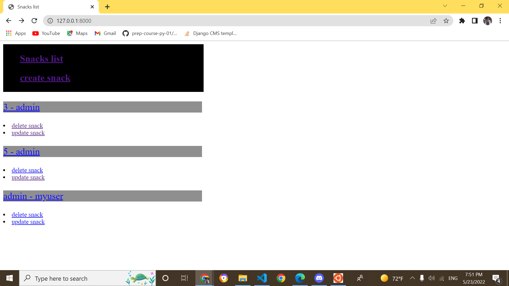
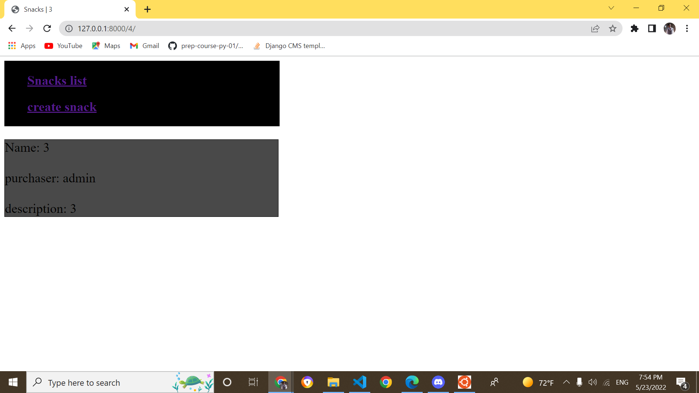
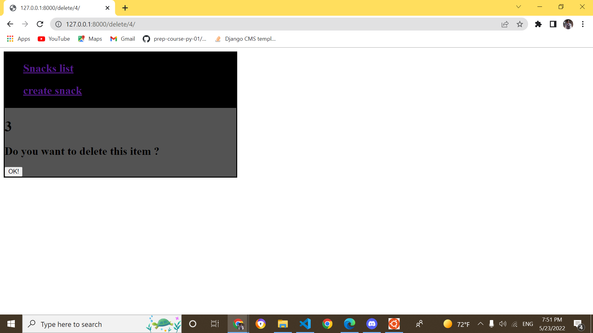
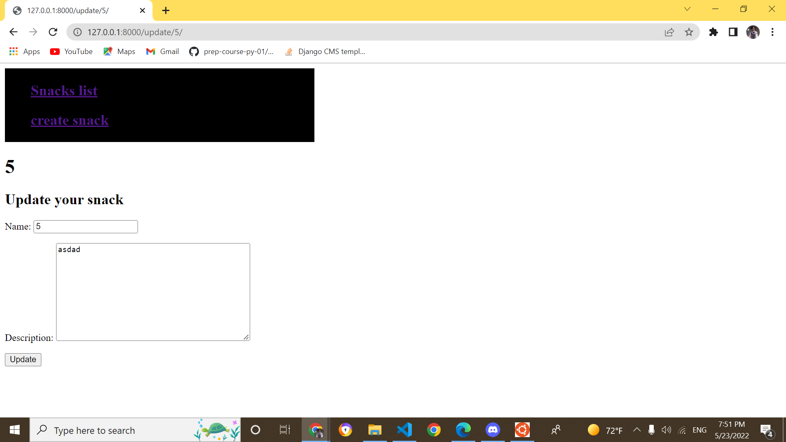
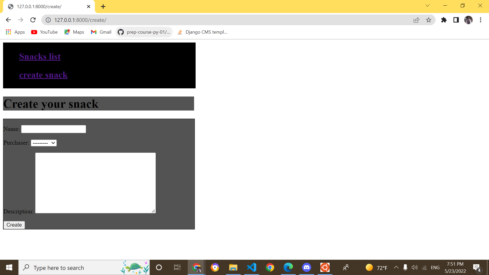

# Django CRUD and Forms

## views

### snack list 

url: ("")

### snack detail 

url: ("'<int:pk>/'")

### delete

url: ("'delete/<int:pk>/'")

### update

url: ("'update/<int:pk>/'")

### create 

url: ("'create/'")

